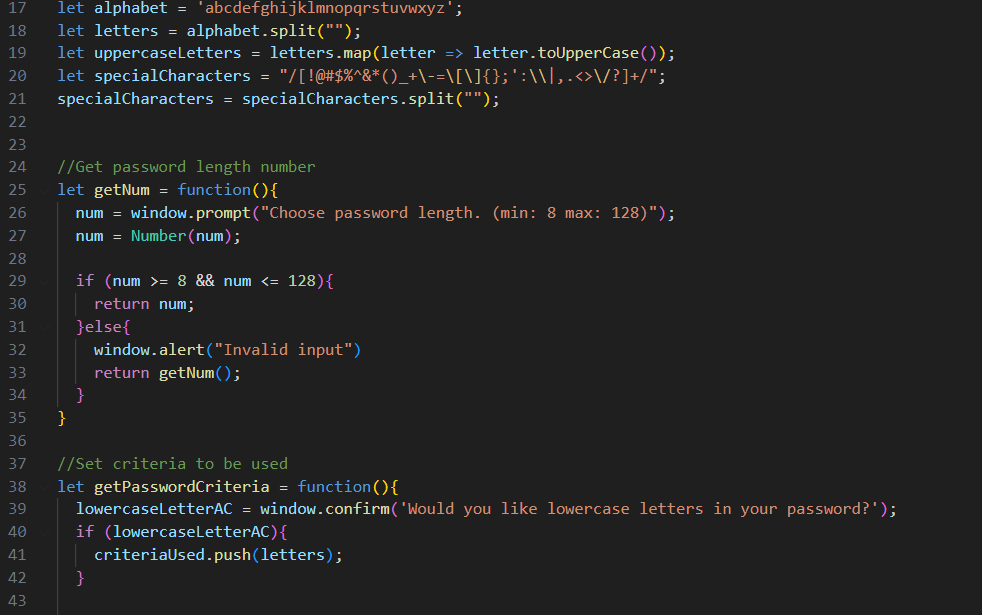
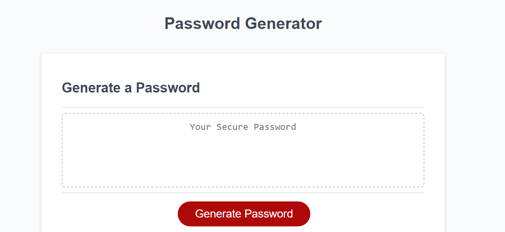

# Password Generator

[This repo](https://github.com/Kal-a11y/generate-password) contains a [web application](https://kal-a11y.github.io/generate-password/) that randomly generates a password based on length and criteria chosen by the user.

## How to Use

First press the generate password button. Next answer the prompts that appear at the top of the page with your preffered critera. Finally copy and use your password that has appeared in the text area or return to the first step to get a different password.

Now head to the [webpage](https://kal-a11y.github.io/generate-password/) to try it yourself.

## The Code

## License
N/A

## Sources

The original source code was cloned from the [friendly-parakeet repository](https://github.com/coding-boot-camp/friendly-parakeet). The original source code is not stored in the [current repository](https://github.com/Kal-a11y/generate-password).